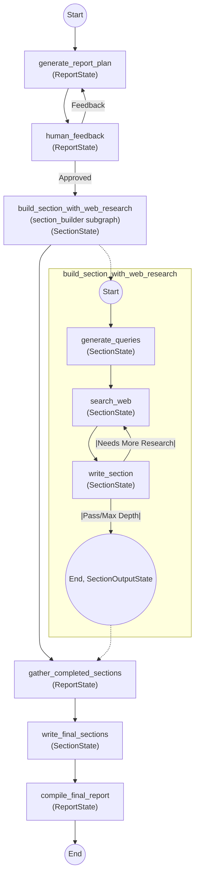

# Research Agent

This agent is designed to generate structured research reports by orchestrating a multi-step workflow using LangGraph. It leverages LLMs and web search APIs to plan, research, and write report sections, with human feedback integrated into the process.

## Node Flow Scenario

The research agent's workflow is implemented as a LangGraph state machine. The main flow and the section subgraph are shown below. State type for each node is indicated in parentheses.



### Node Descriptions
- **generate_report_plan**: Generates the initial report structure and sections based on the topic. *(ReportState)*
- **human_feedback**: Requests human review/feedback on the proposed report plan. Can accept, edit, or request regeneration. *(ReportState)*
- **build_section_with_web_research**: For each section requiring research, generates queries, performs web search, and writes the section iteratively. *(SectionState, see subgraph)*
- **gather_completed_sections**: Collects completed research sections for use as context in summary/final sections. *(ReportState)*
- **write_final_sections**: Writes sections that do not require research (e.g., introduction, conclusion). *(SectionState)*
- **compile_final_report**: Assembles all sections into the final report. *(ReportState)*

#### Section Subgraph Node Descriptions
- **generate_queries**: Generates search queries for the section. *(SectionState)*
- **search_web**: Performs web search for the generated queries. *(SectionState)*
- **write_section**: Writes the section using search results and determines if more research is needed. *(SectionState)*
- **End**: Returns completed section(s). *(SectionOutputState)*

## State Data Types

The agent uses strongly-typed state objects to manage data as it flows through the graph. These are defined in `src/research_graph/state.py`.

### Section (Pydantic Model)
Represents a single report section.
```python
class Section(BaseModel):
    name: str
    description: str
    research: bool
    content: str
```

### Sections (Pydantic Model)
A list of report sections.
```python
class Sections(BaseModel):
    sections: List[Section]
```

### SearchQuery / Queries (Pydantic Models)
Represents a search query and a list of queries.
```python
class SearchQuery(BaseModel):
    search_query: str

class Queries(BaseModel):
    queries: List[SearchQuery]
```

### Feedback (Pydantic Model)
Represents grading and follow-up queries for a section.
```python
class Feedback(BaseModel):
    grade: Literal["pass", "fail"]
    follow_up_queries: List[SearchQuery]
```

### ReportState (TypedDict)
Main state for the report graph.
```python
class ReportState(TypedDict):
    messages: Sequence[BaseMessage]
    ui: Sequence[AnyUIMessage]
    topic: str
    feedback_on_report_plan: str
    sections: list[Section]
    completed_sections: list[Section]
    report_sections_from_research: list[str]
    final_report: str
```

### SectionState (TypedDict)
State for a single section during research/writing.
```python
class SectionState(TypedDict):
    topic: str
    section: list[Section]
    search_iterations: list[int]
    search_queries: list[SearchQuery]
    source_str: list[str]
    report_sections_from_research: list[str]
    messages: Sequence[BaseMessage]
```

### ReportStateInput / ReportStateOutput (TypedDict)
Input and output types for the main graph.
```python
class ReportStateInput(TypedDict):
    messages: Sequence[BaseMessage]

class ReportStateOutput(TypedDict):
    messages: Sequence[BaseMessage]
    ui: Sequence[AnyUIMessage]
    final_report: str
```

## Configuration

Configuration is managed via environment variables and the `Configuration` dataclass in `configuration.py`. See `env.example` for available options (search API, LLM provider, etc).

---

For more details, see the code in `src/research_graph/graph.py` and `src/research_graph/state.py`. 